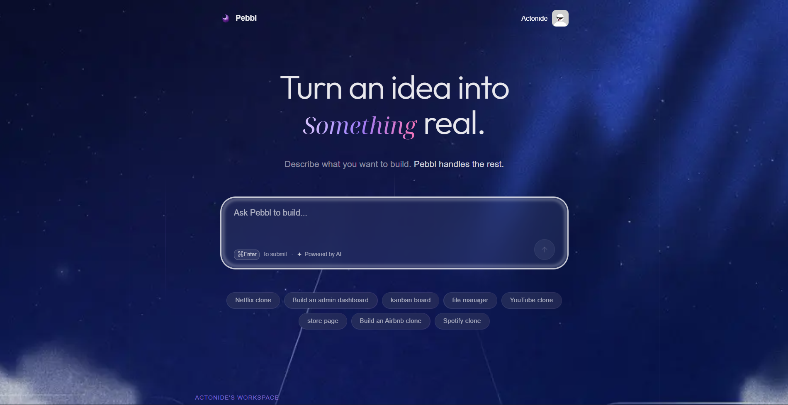
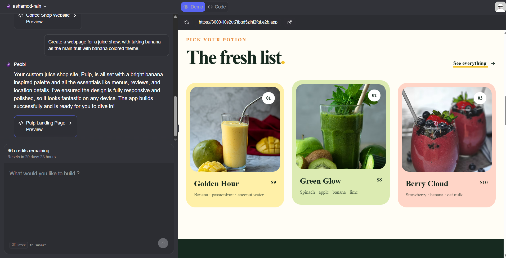
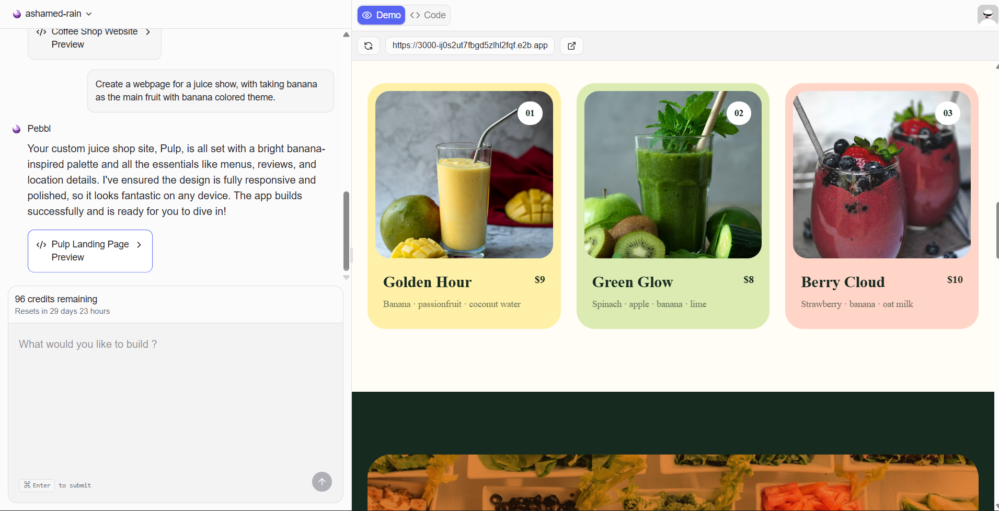
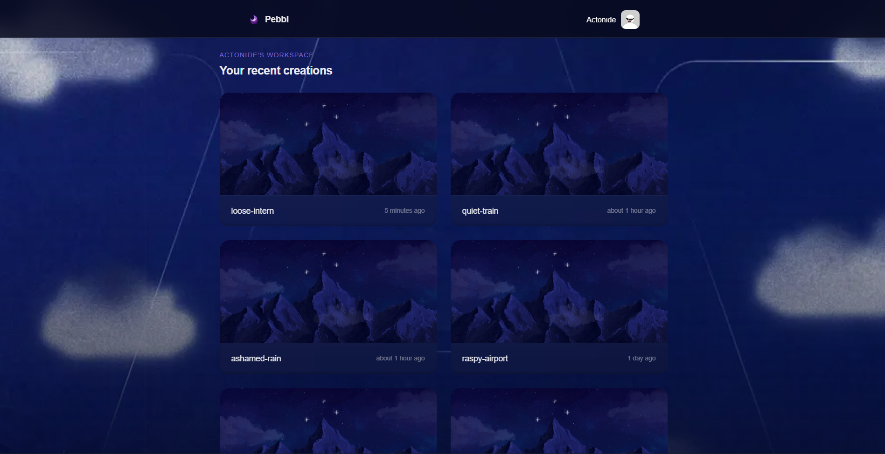
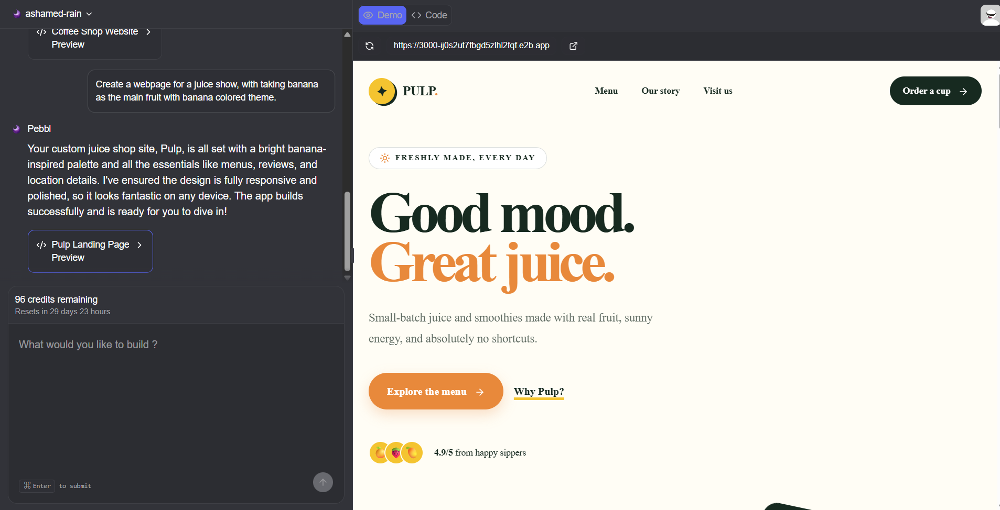

# Pebbl — AI Website Builder

Pebbl is a full-stack web application that generates working Next.js applications from natural-language prompts. A user describes what they want to build, and an AI coding agent writes real code inside an isolated cloud sandbox, verifies that the code compiles, and returns a live preview along with a browsable file explorer of everything it generated.

## Demo

## 📸 Screenshots


<p align="center"><em>Landing page</em></p>

<table>
  <tr>
    <td width="50%"></td>
    <td width="50%"></td>
  </tr>
  <tr>
    <td align="center"><em>Dark theme</em></td>
    <td align="center"><em>Light theme</em></td>
  </tr>
</table>

<table>
  <tr>
    <td width="50%"></td>
    <td width="50%"></td>
  </tr>
  <tr>
    <td align="center"><em>Previous projects list</em></td>
    <td align="center"><em>Generated project workspace</em></td>
  </tr>
</table>

🎥 [Watch the full demo on YouTube](https://youtu.be/J1mG4yCSCFY)
## What It Does

You type a prompt describing an app. Pebbl runs an AI agent in an isolated sandbox to write real code, checks that it builds (auto-fixing errors up to 3 times), then gives you a live preview and the source files.

1. User submits a prompt.
2. Request is saved, a credit is deducted, a background job starts.
3. An AI agent writes the app inside a sandbox using terminal + file tools.
4. The sandbox runs `npm run build`; failures are sent back to the agent to fix.
5. The app is started and previewed live.
6. Result (preview URL, files, summary) is saved and shown in the chat.

## Key Features

- 🧠 Prompt-to-app generation with Next.js + Tailwind + shadcn/ui
- 🛠️ AI agent with real tool use (terminal, file read/write)
- ✅ Auto build-verification with self-fixing retries
- 🌐 Live sandbox preview with a shareable URL
- 📂 In-browser file tree + code viewer
- 💬 Chat-based iteration on the same project
- 🔐 Clerk auth with credit-based usage limits
- 🌗 Light/dark theme
- 📋 Dashboard of past projects

## Tech Stack

| Layer | Technology |
|---|---|
| Framework | [Next.js 15](https://nextjs.org) (App Router), React 19, TypeScript |
| Styling / UI | Tailwind CSS v4, [shadcn/ui](https://ui.shadcn.com) components, `lucide-react` icons |
| API layer | [tRPC](https://trpc.io) + TanStack Query |
| Database | PostgreSQL, accessed via [Prisma](https://www.prisma.io) (`@prisma/adapter-pg`) |
| Background jobs / orchestration | [Inngest](https://www.inngest.com) |
| AI agent | [`@inngest/agent-kit`](https://agentkit.inngest.com) driving an OpenAI-compatible chat model |
| Code execution sandbox | [E2B](https://e2b.dev) (`@e2b/code-interpreter`) |
| Authentication & billing | [Clerk](https://clerk.com) (sign-in/up, plans, `PricingTable`) |
| Rate limiting / usage credits | `rate-limiter-flexible` (Prisma-backed store) |
| Code syntax highlighting | Prism.js |
| Forms & validation | `react-hook-form` + `zod` |

## Architecture

### Data model (Prisma)

- **`Project`** — a generated app/workspace, owned by a Clerk `userId`. Has many `Message`s.
- **`Message`** — a single chat entry (`USER` or `ASSISTANT`), with a `type` of `RESULT` or `ERROR`. An assistant `RESULT` message can have one `Fragment`.
- **`Fragment`** — the output of a successful generation: the sandbox preview URL, a generated title, and a JSON map of file paths to file contents.
- **`Usage`** — backing table for the credit rate limiter (key, remaining points, expiry).

> Note: the schema also contains an unrelated `User`/`Post` pair left over from Prisma's default starter schema; these are not used anywhere in the application (all user identity comes from Clerk).

### Request flow

```
Client (React) 
  → tRPC mutation (projects.create / messages.create)
    → consumes a usage credit (rate-limiter-flexible + Postgres)
    → writes a USER Message (and Project, if new)
    → sends a "code-agent/run" event to Inngest
      → Inngest function `codeAgentFunction`:
          1. creates/reuses an E2B sandbox
          2. loads recent message history for context
          3. runs the coding agent (terminal / createOrUpdateFiles / readFiles tools)
          4. runs `npm run build` in the sandbox (up to 3 attempts, feeding errors back to the agent)
          5. starts the app with `next start` in the sandbox and polls for readiness
          6. generates a title + summary via two follow-up agent calls
          7. saves an ASSISTANT Message + Fragment with the sandbox URL and generated files
  ← client polls messages.getMany and renders the new message, live preview, and file explorer
```

### Project structure (`pebbl/`)

```
src/
  app/                     # Next.js App Router pages
    (home)/                # Landing page, pricing, sign-in/sign-up
    projects/[projectId]/  # Individual project workspace page
    api/inngest/           # Inngest webhook endpoint (serves codeAgentFunction)
    api/trpc/[trpc]/       # tRPC HTTP handler
  modules/
    home/                  # Landing page UI (prompt form, project list, navbar)
    projects/              # Project workspace UI (chat, message list, file/code viewer)
    messages/server/       # tRPC router: create/list messages
    projects/server/       # tRPC router: create/list/get projects
    usage/server/          # tRPC router: usage/credit status
  inngest/
    client.ts              # Inngest client instance
    functions.ts           # codeAgentFunction — the core agent + build-verification pipeline
    utils.ts               # Sandbox connection + message-parsing helpers
  lib/
    db.ts                  # Prisma client (Postgres, via @prisma/adapter-pg)
    usage.ts               # Credit consumption / rate-limit logic
  components/              # Shared UI: file explorer, code viewer, shadcn/ui primitives
  prompt.ts                # System prompts for the coding agent and the title/response generators
prisma/
  schema.prisma            # Database schema
  migrations/               # Prisma migration history
sandbox-templates/nextjs/  # E2B sandbox template (Dockerfile + boot script) used to build the sandbox image
```

## Getting Started

### Prerequisites

- Node.js
- A PostgreSQL database
- Accounts/API keys for: [Clerk](https://clerk.com), [E2B](https://e2b.dev), and the OpenAI-compatible model providers configured in `src/inngest/functions.ts`

### 1. Install dependencies

```bash
npm install
```

`npm install` also runs `prisma generate` automatically via the `postinstall` script.

### 2. Configure environment variables

Create a `.env` file in the `pebbl/` directory:

```dotenv
DATABASE_URL=""
NEXT_PUBLIC_APP_URL=""
INNGEST_DEV=1
E2B_API_KEY=""
TOKEN_MAX_API_KEY=""
NEXT_PUBLIC_CLERK_PUBLISHABLE_KEY=
CLERK_SECRET_KEY=
NEXT_PUBLIC_CLERK_SIGN_IN_URL=/sign-in
NEXT_PUBLIC_CLERK_SIGN_UP_URL=/sign-up
NEXT_PUBLIC_CLERK_SIGN_IN_FALLBACK_REDIRECT_URL=/
NEXT_PUBLIC_CLERK_SIGN_UP_FALLBACK_REDIRECT_URL=/
EXPLABS_API_KEY=""
```

| Variable | Purpose |
|---|---|
| `DATABASE_URL` | PostgreSQL connection string used by Prisma |
| `NEXT_PUBLIC_APP_URL` | Base URL used to build the server-side tRPC client URL |
| `INNGEST_DEV` | Runs Inngest in local dev mode against the local Inngest Dev Server |
| `E2B_API_KEY` | Auth key for creating/connecting to E2B sandboxes |
| `TOKEN_MAX_API_KEY` | API key for the model provider used by the fragment-title and response-generator agents (`api.tokenmix.ai`) |
| `NEXT_PUBLIC_CLERK_PUBLISHABLE_KEY` / `CLERK_SECRET_KEY` | Clerk authentication keys |
| `NEXT_PUBLIC_CLERK_SIGN_IN_URL` / `NEXT_PUBLIC_CLERK_SIGN_UP_URL` | Paths to the sign-in/sign-up pages |
| `NEXT_PUBLIC_CLERK_SIGN_IN_FALLBACK_REDIRECT_URL` / `..._SIGN_UP_FALLBACK_REDIRECT_URL` | Where Clerk redirects users after auth |
| `EXPLABS_API_KEY` | API key for the model provider used by the main coding agent (`api.experientiallabs.ai`) |

### 3. Set up the database

Apply the existing Prisma migrations to your database:

```bash
npx prisma migrate deploy
```

### 4. Run the app

The app needs two processes running locally: the Next.js dev server and the Inngest dev server (which executes the `codeAgentFunction` background job and lets you inspect runs at `http://localhost:8288`).

```bash
npm run dev
```

```bash
npx inngest-cli@latest dev
```

Then open `http://localhost:3000`.

### 5. Sandbox template

AI-generated projects run inside an E2B sandbox built from the template in `sandbox-templates/nextjs/` (a Dockerfile that installs a pinned Next.js + shadcn/ui project and a boot script that starts `next dev`). This template must be built and available under the E2B project referenced in `src/inngest/functions.ts` for code generation to work end-to-end.

## Scripts

| Script | Description |
|---|---|
| `npm run dev` | Starts the Next.js dev server (Turbopack) |
| `npm run build` | Builds the app for production |
| `npm run start` | Runs the production build |
| `npm run lint` | Runs ESLint |
| `npm run postinstall` | Runs `prisma generate` automatically after `npm install` |

## Notable Implementation Details

- The coding agent is constrained by a system prompt (`src/prompt.ts`) that requires it to work only inside the sandbox's `/home/user/nextjs-app` directory, use Tailwind/shadcn, avoid touching `package.json`/lockfiles directly, and stop as soon as `npm run build` succeeds.
- Build verification is a hard gate: if the sandboxed app fails to build after 3 attempts, the job throws and no fragment is saved, instead of silently returning broken output.
- After a successful build, the sandbox's dev server is stopped and the app is restarted with `next start` (a production server) before the preview URL is handed to the user.
- Usage limits are enforced server-side in the tRPC `create` mutations (both for new projects and new messages) before any Inngest job is triggered, so credits are only consumed for requests that are actually queued for generation.

## 📄 License

This project is for educational/portfolio purposes.

---

## 👤 Author

**Aryan Gupta**
GitHub: [@Aryan-Gupta2002](https://github.com/Aryan-Gupta2002)
